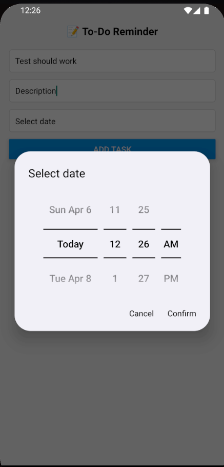
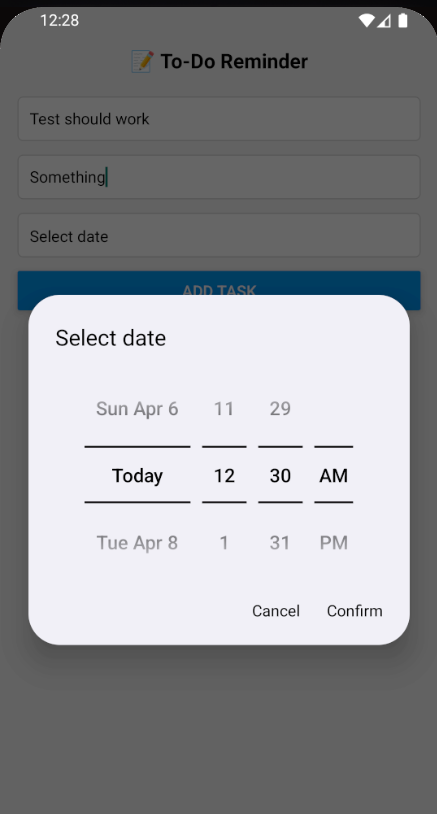
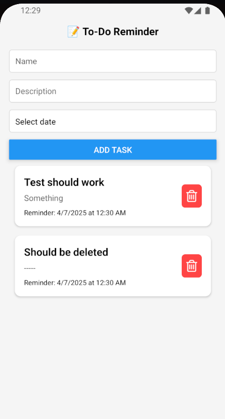
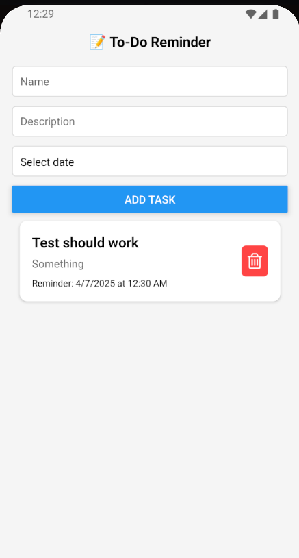
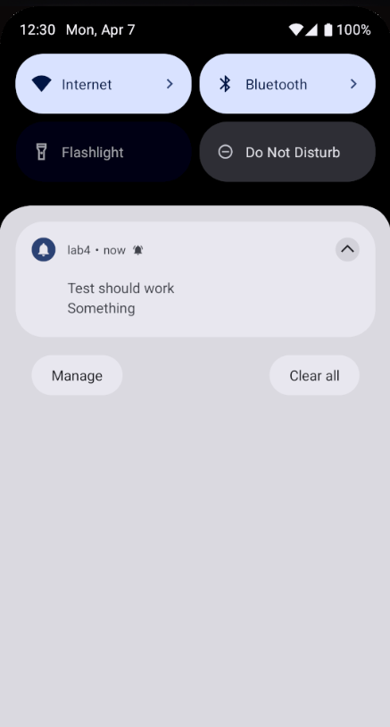

# Welcome to your Expo app 👋

This is an [Expo](https://expo.dev) project created with [
`create-expo-app`](https://www.npmjs.com/package/create-expo-app).

## Get started

1. Install dependencies

   ```bash
   npm install
   ```

2. Start the app

   ```bash
    npm run android
   ```








